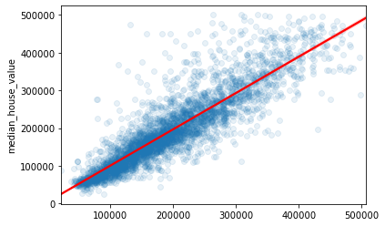

# District-Real-Estate
**The goal is to build a model for the median value of housing in a district of California given a finite number of caracteristics.**

The data used is obtained on Kaggle (https://www.kaggle.com/camnugent/california-housing-prices). It contains information from the 1990 California census. 
Note that the data is outdated and the model that we will obtain will be useless at predicting current house prices. The exercise would nonetheless be the same if 
we had up to date housing data.

In this project, we:
- Import and look and the at the dataset
- Perform simple exploratory data analysis
- Pre-process the data and add features based on common-sense assumptions
- Train multiple models on the data and select the one with the best performance
- Tune the best model's hyperparameters
- Predict housing price for unseen data and estimate prediction confidence intervals
- Explain the results obtained using the *Shapash* library.

## Import the Data and Have a First Look

We first need to get a familiar with the dataset. To do so, we:
- Look at the dataframe
- Look at df.info() and df.describe() to get high level informations on the dataset
- Plot histograms for numerical data

The description of the columns is presented below:
1. longitude: A measure of how far west a house is; a higher value is farther west

2. latitude: A measure of how far north a house is; a higher value is farther north

3. housingMedianAge: Median age of a house within a block; a lower number is a newer building

4. totalRooms: Total number of rooms within a block

5. totalBedrooms: Total number of bedrooms within a block

6. population: Total number of people residing within a block

7. households: Total number of households, a group of people residing within a home unit, for a block

8. medianIncome: Median income for households within a block of houses (measured in tens of thousands of US Dollars)

9. medianHouseValue: Median house value for households within a block (measured in US Dollars)

10. oceanProximity: Location of the house w.r.t ocean/sea

From the above steps, we get the following insights on the dataset:
- The dataset is relatively small (20,640 rows, 10 columns)
- There is a small amount of missing values (207 values) in the total_bedrooms column (**will be adressed in data pre-processing**)
- There is one categorical feature (ocean_proximity)
- The ocean proximity feature contains 5 category (**will be converted in data pre-processing**)
- From the histograms, it is possible to see a bump in the last bin for housing median age, median value and the median income of households. It seems these features were capped in the following way:
    - median income: 0.4999-15.0001 (in ten of thousands of USD)
    - median age: 1-52
    - median value (target for the estimation): 14,999-500,001
- The "capping" **will need to be adressed in the data pre-processing step**.
- The features also are on different scales. The data **will to be scaled**.
- Most of the features have long tails distributions.

We also split the data into train and test sets.

## Exploratory Data Analysis
The next step is to explore the data visually. The hope is to find obvious patterns that we could use (for feature engineering for example).

Let's first state some common sense assumptions on what we expect to see in the data. It is important in my opinion to always state assumptions based on common sense or subject matter expertise before beginning to work on the data. The more complex the data, the more time you should spend learning about the field. Subject matter expertise can lead to intelligent feature engineering that will help the model spot patterns. Below are common sense assumptions for all features:
- longitude and latitude: these should not directly affect house value since the absolute location does not say much about the value of a house, but we could use this information to derive proximity to large cities for example which we expect will affect housing price.
- housing median age: I would expect older housing to be cheaper.
- The number of rooms and bedrooms: we will first need to convert it on a room per household basis. Then it would be interesting in my opinion to have the following features related to rooms:
    - bedrooms/household (I expect more bedrooms to be more expensive)
    - total rooms/household (I expect more rooms to be more expensive)
    - bedrooms/rooms (This is less obvious. Let's wait for the results)
- population and households: I do not expect those 2 to have a significant impact on pricing.
- median income: this feature will probably have a large impact. People that make more money will probably on average buy more expensive houses.

In this section we:
- Look at the price data geographically
- Confirm visually the assumption that house near large cities are more expensive
- Confirm that the feature most correlated with the housing price is the median income

## Feature Combinations and Pre-processing Pipelines
As said earlier, we want to combine and modify some of the features so they become more meaningful:
- Get the proximity to large cities
- Get bedrooms/household 
- Get total rooms/household 
- Get bedrooms/rooms
- Get population/household

In this section we:
- Impute missing total bedrooms values using the median
- Add attributes listed above
- Scale the data
- Encode the ocean proximity categorical attribute

## Model Training and Evaluation

We tested 9 popular models for the regression problem. CatBoost had the best performance and was selected for tuning.

## Tuning and Evaluating the Best Model

We tuned the catboost model and compared it against an autoML tool developped by Microsoft (FlaML). The performance between the model we train and the one obtained by the autoML tool were very similar.

### Actual vs Predicted (Trained Model)

### Actual vs Predicted (AutoMl Model)

